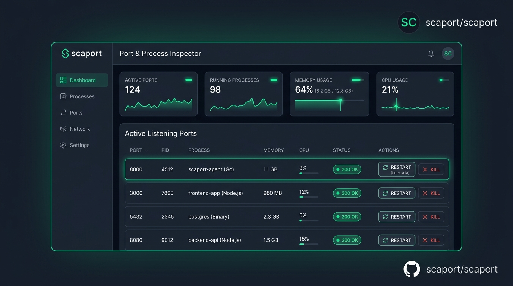

<div align="center">

# ⚡ GOENMA scaport (`scaport`)

**El orquestador definitivo e inteligente de puertos y procesos locales para desarrolladores.**

[](https://go.dev/)
[](https://github.com/eyejdev/scaport/releases)
[](LICENSE)
[]()
[]()

**Parte del ecosistema de herramientas de alto rendimiento de GOENMA.**

> **¿Qué es scaport?**
> A diferencia de los comandos comunes para "matar puertos", **scaport** es un centro de control local de alto rendimiento y ultrabajo consumo. Inspecciona sockets en tiempo real, vincula PIDs con sus proyectos y árboles de ejecución, monitoriza la salud y latencias de tus servicios HTTP, previene colisiones antes de arrancar tu stack y permite reiniciar procesos congelados al vuelo (*Hot-Cycle*).

<br/>



</div>

---

## 🎯 ¿Por qué usar scaport?

Durante el desarrollo diario en stacks modernos (Node.js, Vite, Next.js, FastAPI, Go, Docker, PostgreSQL, etc.), los desarrolladores se enfrentan continuamente a:
- 🚫 **Errores `EADDRINUSE` o `bind: address already in use`:** Al intentar levantar un servidor cuando otro proceso previo no cerró el socket.
- 🧟 **Procesos Zombis o Huérfanos:** Servidores en segundo plano consumiendo memoria RAM y bloqueando puertos de desarrollo populares (`:3000`, `:5173`, `:8080`).
- 🧊 **Servidores Congelados (*Silent Deadlocks*):** El socket TCP sigue abierto en el sistema operativo, pero el runtime de la aplicación (Node/Python/Go) se quedó en un bucle infinito o error no capturado y no responde a ninguna petición.
- 🛡️ **Riesgo de Finalizar Procesos del Sistema:** Intentar matar puertos a ciegas con `kill -9` o `taskkill` puede terminar servicios críticos del sistema operativo como el PID 4 en Windows o dañar bases de datos activas.

**scaport** resuelve todo esto en una única herramienta nativa, ultraligera y sin dependencias externas.

---

## 📚 Conceptos Clave (Para Principiantes y Avanzados)

| Concepto | Explicación para Principiantes | Explicación Técnica para Avanzados |
| :--- | :--- | :--- |
| **Puerto (Port)** | Como un número de puerta o departamento en tu computadora por donde entra el tráfico de un programa específico (ej. `:3000`). | Identificador numérico de 16 bits (0-65535) en la capa de transporte (TCP/UDP) para multiplexar conexiones de red. |
| **PID (Process ID)** | El número de identificación único que el sistema le asigna a cada programa en ejecución. | Identificador único de proceso del kernel utilizado para gestionar señales (`SIGTERM`, `SIGKILL`), memoria RSS y descriptores de archivo. |
| **Estado Health (Salud)** | Indica si tu aplicación web realmente funciona y responde cuando alguien la visita. | Sondeo HTTP asíncrono con `GET /` o `GET /health` evaluando códigos de respuesta (`200 OK`, `4xx`, `5xx`) y tiempos de latencia (RTT en ms). |
| **Hot-Cycle (Reinicio Rápido)** | Apaga tu servidor y lo vuelve a prender al instante sin tener que volver a escribir el comando. | Termina el proceso (`SIGKILL`/`TerminateProcess`) y spawnea un nuevo proceso conservando el mismo directorio (`CWD`), argumentos de línea de comandos (`cmdline`) y entorno. |
| **System Shield (Escudo)** | Protección de seguridad que evita que apagues cosas importantes de tu computadora por error. | Capa de validación que bloquea la terminación de procesos críticos (`PID <= 4`, `System`, `svchost.exe`, `csrss.exe`, `init`, `launchd`). |

---

## 👁️ ¿Qué es y qué hace el "Modo Monitor / Watch Daemon"?

**scaport** implementa dos modos complementarios de supervisión para adaptarse a cualquier flujo de trabajo:

```text
┌────────────────────────────────────────────────────────────────────────┐
│                        NIVELES DE SUPERVISIÓN                          │
├──────────────────────────────────┬─────────────────────────────────────┤
│ 1. Descubrimiento Pasivo (SSE)   │ 2. Watch Daemon Activo (Sondeo)     │
│ • Lee tablas TCP/UDP del Kernel  │ • Envía peticiones HTTP periódicas  │
│ • Cero tráfico de red (< 0.1% CPU│ • Detecta congelamientos silenciosos│
│ • Activo por defecto en Web/TUI  │ • Enfocado en puertos dev a demanda │
└──────────────────────────────────┴─────────────────────────────────────┘
```

### 1. Descubrimiento Pasivo (Activo por defecto)
- **¿Cómo funciona?** Inspecciona la tabla de red del Sistema Operativo cada ~1.5s sin enviar ningún paquete de red a los puertos.
- **Ventaja:** Cero impacto en CPU o memoria. Si abres o cierras un servidor, la interfaz se actualiza de inmediato mediante Server-Sent Events (SSE).

### 2. Modo Monitor / Watch Activo (`scaport watch` o Botón 👁️ en Web)
- **¿Cómo funciona?** Además de leer los sockets, **envía periódicamente peticiones HTTP GET** a los puertos objetivo para comprobar si la aplicación está viva y procesando datos.
- **¿Qué problema resuelve?** Detecta **bloqueos silenciosos / congelamientos**: cuando un servidor Node/Python/Go sufre un *deadlock* o bucle infinito, el socket sigue en estado `LISTENING` en el OS, pero ya no atiende tráfico web. El Watch Daemon detecta el timeout y te alerta con `🔴 Unhealthy / Frozen` para que puedas aplicar un *Hot-Cycle* inmediato.
- **¿Por qué es opcional?** En una máquina común existen 30-80 puertos abiertos (AnyDesk, Spotify, PostgreSQL, Redis, servicios del OS). Enviar peticiones HTTP a protocolos binarios o de escritorio generaría conexiones rechazadas innecesarias y falsos positivos. Por eso el Watch activo se ejecuta sobre tus puertos de desarrollo específicos.

---

## 🛑 ¿Se pueden cerrar los procesos sin consumo con el botón Kill?

Al escanear tu máquina, notarás puertos en rangos altos (ej. `:49678`, `:52107`) con memoria `- MB` o tiempo `unknown`. Esto ocurre porque pertenecen a sockets efímeros o servicios de Windows/OS donde el sistema restringe la telemetría de memoria a procesos de usuario no elevados.

* **✅ Procesos de Usuario en Segundo Plano:** Si el puerto fue abierto por una aplicación o worker de usuario, **hacer clic en Kill finaliza el proceso y libera el puerto inmediatamente**.
* **🛡️ Procesos del Kernel (PID 4, System Kernel):** scaport activa automáticamente su **System Shield**, deshabilitando el botón o mostrando la insignia `Shield` para evitar cierres accidentales que desestabilicen tu sistema operativo.
* **🔒 Servicios con Permisos del Sistema:** Si un servicio requiere permisos de administrador (`SYSTEM`) y se intenta terminar sin privilegios suficientes, el sistema operativo denegará la acción y scaport te informará con una notificación limpia de error.

---

## ✨ Características Principales

* 🔌 **Escaneo en Tiempo Real:** Detección instantánea de sockets `LISTEN` (TCP/UDP, IPv4 e IPv6).
* 🌐 **Soporte Bilingüe Completo (Español ⇄ English / i18n):** Alterna el idioma de toda la interfaz en 1 clic con persistencia en `localStorage`.
* 🌙 / ☀️ **Selector de Tema Claro y Oscuro:** Tema oscuro predeterminado con soporte completo y alto contraste para modo claro.
* 🧠 **Smart Advisor con 432 Tips Aleatorios:** Carrusel educativo con más de 430 consejos de redes, React 19, Go, Rust, Docker, Kubernetes, AI/LLMs y arquitectura limpia.
* 📦 **Detección Automática de Proyectos:** Identifica si un puerto pertenece a Vite, Next.js, FastAPI, Go, Docker, PostgreSQL, Redis, etc.
* 🩺 **Sondas de Salud Automáticas:** Semáforo visual en verde/amarillo/rojo según el código HTTP devuelto y su latencia.
* 📊 **Telemetría y Gráficos en Vivo:** Sparklines animadas de memoria RAM y sockets con escalas claras, monitor de latencias HTTP y exportación de informes de rendimiento en Markdown/JSON.
* 🛡️ **Centinela Anti-Colisiones `scaport check`:** Código de salida `0` si los puertos están libres y `1` si hay conflicto (ideal para `predev` scripts).
* ⚡ **Hot-Cycle Process:** Atajo `r` o botón web para reiniciar procesos congelados en un clic sin perder su contexto.
* 📥 **Exportación Universal (JSON, Markdown, CSV, HTML):** Genera auditorías y reportes completos para terminal, GitHub, Excel o navegadores.
* 📜 **Historial de Acciones & Auditoría:** Registro de procesos finalizados, reiniciados o exportados con timestamp.

---

## 📦 Instalación

### Vía Go (Recomendado)
```bash
go install github.com/eyejdev/scaport@latest
```

### Binarios Precompilados (GitHub Releases)
Descarga el binario ejecutable para tu sistema operativo (Windows, macOS Intel/Apple Silicon, Linux) directamente desde la sección de [Releases](https://github.com/eyejdev/scaport/releases).

---

## 🚀 Guía de Uso Rápido

### 1. Iniciar el Dashboard Web (Recomendado)
```bash
scaport --web
# Abre automáticamente http://localhost:9119 en tu navegador predeterminado
```
*Puedes personalizar el puerto con `--port` (ej. `scaport -w -p 8080`).*

---

### 2. Iniciar la Terminal Interactiva (TUI)
```bash
scaport
```

#### Atajos de teclado en la TUI:
* `↑` / `↓` o `j` / `k`: Navegar entre puertos.
* `k` / `x`: Terminar proceso seleccionado de forma limpia.
* `r`: *Hot-Cycle* (reiniciar proceso con sus argumentos originales).
* `h`: Ejecutar sondas de salud HTTP en los puertos activos.
* `/`: Filtrar en vivo por número de puerto, PID, proyecto o tecnología.
* `e`: Exportar instantánea en tabla Markdown.
* `q` / `Ctrl+C`: Salir.

---

### 3. Centinela Anti-Colisiones (Pre-scripts / CI / Makefiles)
Verifica si uno o más puertos están disponibles antes de arrancar tu stack de desarrollo:
```bash
scaport check 3000 8080 5432
```

#### Integración en `package.json`:
```json
{
  "name": "mi-proyecto",
  "scripts": {
    "predev": "scaport check 3000 5432",
    "dev": "next dev",
    "prestart": "scaport check 8080"
  }
}
```
*Si el puerto 3000 o 5432 está ocupado, el comando saldrá con código de error `1` y mostrará qué proceso lo bloquea, evitando arranques fallidos.*

---

### 4. Modo Monitor / Watch Daemon por CLI
Vigila continuamente la salud de tus microservicios y recibe notificaciones en consola si alguno se cae o se congela:
```bash
# Monitorear puertos clave cada 2 segundos
scaport watch 3000 8080 5432

# Con intervalo personalizado de 1 segundo (1000ms)
scaport watch --interval 1000 3000 5173
```

---

### 5. Liberación Rápida de Puertos
```bash
# Matar el proceso escuchando en el puerto 3000
scaport kill 3000

# O matar directamente por PID
scaport kill 14520 --force
```

---

### 6. Exportar Reportes de Puertos y Procesos en Múltiples Formatos
```bash
# 1. Exportar como tabla Markdown limpia (para GitHub READMEs / PRs)
scaport --md > active-ports.md

# 2. Exportar como JSON estructurado (para pipelines y jq)
scaport --json > active-ports.json

# 3. Exportar como CSV estándar (para Excel y Google Sheets)
scaport --csv > active-ports.csv

# 4. Exportar como reporte HTML visual autónomo (offline)
scaport --html > active-ports.html
```

---

## 🛠️ Matriz de Comandos CLI

| Comando | Descripción | Formatos / Flags |
| :--- | :--- | :--- |
| `scaport` | Inicia la Terminal Interactiva (TUI con Charm). | `-w, --web`, `-p, --port`, `-i, --interval` |
| `scaport --web` | Levanta el servidor HTTP con Dashboard en vivo (SSE). | `-p, --port <num>` (default 9119) |
| `scaport --md` | Exporta snapshot instantáneo en tabla Markdown. | Salida directa a `stdout` |
| `scaport --json` | Exporta snapshot instantáneo en JSON formateado. | Salida directa a `stdout` |
| `scaport --csv` | Exporta snapshot en CSV compatible con Excel/Sheets. | Salida directa a `stdout` |
| `scaport --html` | Genera reporte visual HTML interactivo y autónomo. | Salida directa a `stdout` |
| `scaport check <puertos...>` | Valida disponibilidad de puertos para scripts/CI. | Exit code `0` (libre) / `1` (ocupado) |
| `scaport watch <puertos...>` | Daemon de vigilancia activa de salud HTTP. | `-i, --interval <ms>` (default 2000) |
| `scaport kill <puerto o PID>` | Termina el proceso que ocupa el puerto. | `-f, --force` |
| `scaport version` | Muestra versión, arquitectura y detalles del build. | Salida directa a `stdout` |

---

## 🤝 Comunidad, Soporte y Patrocinio

**scaport** es un proyecto de código abierto desarrollado y mantenido con dedicación para la comunidad de desarrolladores por **eyejdev**.

* ☕ **Apoya el desarrollo:** [Buy Me a Coffee](https://buymeacoffee.com/eyejdev)
* 💖 **GitHub Sponsors:** [github.com/sponsors/eyejdev](https://github.com/sponsors/eyejdev)
* ⭐ **Déjanos una estrella:** Si esta herramienta te ahorra tiempo en tu flujo diario, ¡apóyanos con una estrella en GitHub!
* 🐛 **Feedback & Issues:** [Reportar un problema o sugerir una mejora](https://github.com/eyejdev/scaport/issues)

---

<div align="center">
  <sub>Licencia MIT © 2026 eyejdev. Creado con ❤️ como parte del ecosistema <strong>GOENMA</strong>.</sub>
</div>
